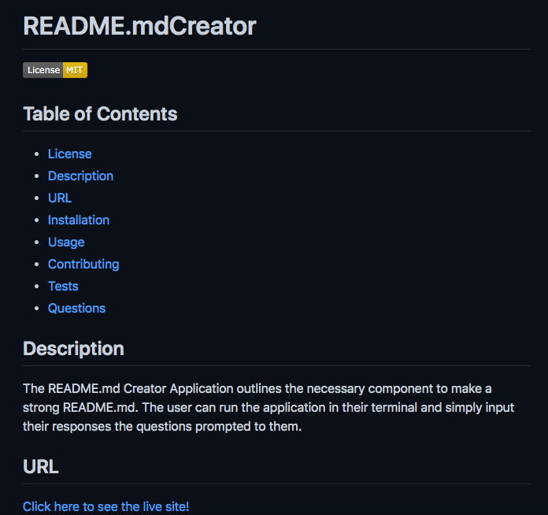

# README.mdCreator

## Table of Contents
* [License](#license)
* [Description](#description)
* [URL](#url)
* [Installation](#installation)
* [Usage](#usage)
* [Contributing](#contributing)
* [Tests](#tests)
* [Questions](#questions)

## Description 
The README.md Creator Application outlines the necessary component to make a strong README.md. The user can run the application in their terminal and simply input their responses the questions prompted to them.

## URL
[Click here to see the live site!](./Demovideo.mp4)

## Installation
npm i, npm i inquirer, npm i fs

## Usage
README.mdCreator is an open source for a user to generate a README.md

## Contributing
undefined

## Tests
There are no tests to run for this application.

## Questions
Please contact me below with any questions you have about the appiction.
* Github: https://github.com/margaretelson
* Email: margaret.a.elson@gmail.com

    